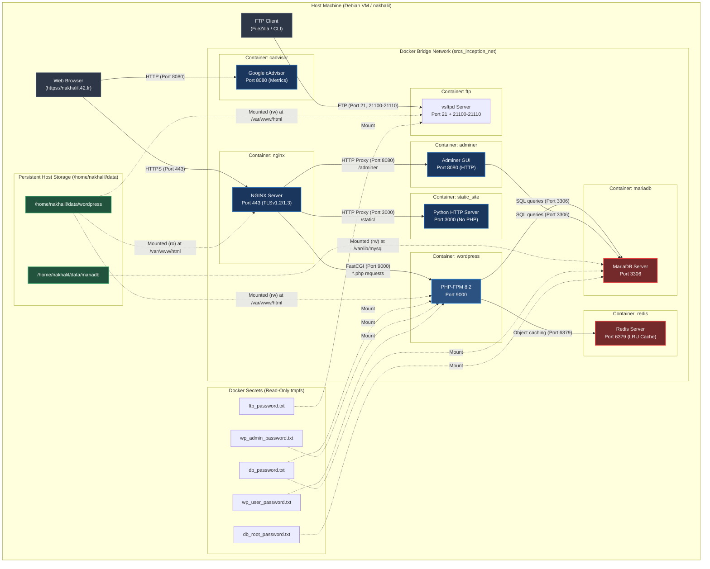

# Inception — Architecture & Docker Networking Reference

A comprehensive guide to the Inception infrastructure: service architecture, inter-container communication, shared storage, secrets, and an in-depth deep dive into **Docker Networking**.

---

## 1. Complete Infrastructure Architecture Diagram



---

## 2. Inter-Service Communication & Routing Matrix

| Caller | Target | Channel / Port | Protocol | Purpose & Data Exchanged |
| :--- | :--- | :--- | :--- | :--- |
| **Browser** | `nginx` | Host Port 443 | **HTTPS** (TLSv1.2/1.3) | Single external HTTPS entrypoint. Decrypts TLS and evaluates URL paths. |
| `nginx` | `wordpress` | `wordpress:9000` | **FastCGI** (TCP) | Routes all dynamic `.php` files to PHP-FPM worker pool. |
| `nginx` | `adminer` | `adminer:8080` | **HTTP** (TCP) | Reverse proxies `/adminer` location block to Adminer PHP web server. |
| `nginx` | `static_site` | `static_site:3000` | **HTTP** (TCP) | Reverse proxies `/static/` location block to Python 3 HTTP server. |
| `wordpress` | `mariadb` | `mariadb:3306` | **MySQL Protocol** (TCP) | Executes SQL queries to read/write WordPress posts, users, and options. |
| `wordpress` | `redis` | `redis:6379` | **RESP** (Redis Protocol) | In-memory object cache; stores serialized DB query results in RAM. |
| `adminer` | `mariadb` | `mariadb:3306` | **MySQL Protocol** (TCP) | Web GUI administration; executes SQL queries directly on `wordpress_db`. |
| **FTP Client** | `ftp` | Host Ports 21, 21100–21110 | **FTP** Control & Passive Data | Direct file management for themes, plugins, and uploads on `wordpress_vol`. |
| **Browser** | `cadvisor` | Host Port 8080 | **HTTP** | Google cAdvisor web UI for live CPU/RAM/IO container telemetry. |

---

## 3. Deep Dive: Docker Networking Explained in Detail

Understanding Docker networking is a major focus of 42 School evaluations. Below is the technical breakdown from Linux kernel concepts up to Docker Compose DNS resolution.

### A. What is a Docker Network Under the Hood?
A Docker container is not an isolated machine; it is a regular Linux process running inside isolated **kernel namespaces**:
1. **Network Namespace (`netns`)**: Each container gets its own virtual network stack (its own loopback interface `lo`, routing table, IP address, and `eth0` interface).
2. **Virtual Ethernet Pair (`veth`)**: Like a virtual ethernet cable with two ends:
   - One end is placed inside the container's namespace and named `eth0`.
   - The other end remains on the host machine and is attached to a virtual bridge interface (named `br-xxxxxx`).
3. **Linux Bridge Device (`br-xxxxxx`)**: Software switch created by Docker on the host. When containers communicate with each other, packets travel out of container A's `eth0`, through the `veth` pair into the software bridge, and out the second `veth` pair into container B's `eth0`.

```
 Container A (wordpress)                           Container B (mariadb)
 ┌──────────────────────┐                         ┌──────────────────────┐
 │ IP: 172.20.0.3       │                         │ IP: 172.20.0.2       │
 │ interface: eth0      │                         │ interface: eth0      │
 └──────────┬───────────┘                         └──────────┬───────────┘
            │                                                │
   veth pair 1                                      veth pair 2
            │                                                │
 ═══════════▼════════════════════════════════════════════════▼════════════
             HOST LINUX BRIDGE DEVICE (br-srcs_inception_net)
 ════════════════════════════════════════════════════════════════════════
```

---

### B. Automatic Service Discovery via Docker Embedded DNS (`127.0.0.11`)

In traditional networking, machines must connect using static IP addresses. However, in Docker, container IP addresses are dynamic and change every time a container restarts.

Docker solves this with **Automatic DNS Service Discovery**:
1. When a user-defined bridge network (`srcs_inception_net`) is created, Docker runs an embedded DNS server at `127.0.0.11` inside every container on that network.
2. When WordPress wants to reach MariaDB, it connects to host **`mariadb`** on port **`3306`**.
3. The container's OS queries `127.0.0.11` for the name `mariadb`.
4. Docker's internal DNS intercepts the query and instantly returns MariaDB's current container IP (e.g., `172.20.0.2`).
5. This eliminates the need for hardcoded IP addresses or hacky `/etc/hosts` synchronization.

---

### C. Network Isolation: `ports:` vs `expose:`

Understanding this distinction is mandatory for the subject:

| Directive | Where Used | Effect | Scope |
| :--- | :--- | :--- | :--- |
| **`expose:`** | `docker-compose.yml` | Documents and permits access to specified ports **only within the internal Docker bridge network**. | Containers on `inception_net` only. **Blocked from host and internet**. |
| **`ports:`** | `docker-compose.yml` | **Port Publishing / Port Forwarding** (`host_port:container_port`). Uses Linux `iptables` NAT to map a port from the host interface to the container. | **Public / Host accessible**. |

#### Why this matters for 42 Inception:
- **MariaDB** (`expose: 3306`) and **WordPress** (`expose: 9000`) only use `expose:`. The host machine cannot connect directly to `localhost:3306` or `localhost:9000`. This prevents unauthorized external access to the database and PHP engine.
- **NGINX** (`ports: - "443:443"`) uses `ports:`. It punches through the firewall so the outside world can access HTTPS on the host machine.

---

### D. Comparison: User-Defined Bridge vs Host Network vs Legacy `--link`

The Inception subject explicitly forbids both `network_mode: host` and `--link`. Here is the technical justification:

#### 1. User-Defined Bridge (`inception_net`) — *Mandatory & Best Practice*
- **Isolation**: Containers run in private network namespaces.
- **Service Discovery**: Built-in DNS resolver allows communication by container name (`wordpress`, `mariadb`).
- **Security**: Granular control over which ports are published to the host.
- **Compliance**: Fully complies with 42 subject requirements.

#### 2. Host Network (`network_mode: host`) — *Strictly Forbidden*
- **No Isolation**: The container does not get its own network namespace or IP address; it shares the host's network stack directly.
- **Port Conflicts**: If the container binds to port 443, port 443 on the host is occupied directly without Docker NAT.
- **Security Risk**: If a container is compromised, the attacker has immediate access to all host network interfaces.

#### 3. Legacy Links (`--link` / `links:`) — *Strictly Forbidden*
- **Deprecated Mechanism**: An outdated Docker feature that wrote static IP addresses directly into each container's `/etc/hosts` file at startup.
- **Fragile**: If container A restarted and received a new IP address, container B's `/etc/hosts` became stale and broke communication.
- **Superseded**: Replaced entirely by user-defined bridge networks with dynamic DNS in Docker 1.10+.

---

### E. Diagnostic Commands for Evaluations

Evaluators often ask to inspect the network live during defense:

```bash
# 1. List all Docker networks
docker network ls

# 2. Inspect the Inception network (shows all connected containers & IPs)
docker network inspect srcs_inception_net

# 3. Test DNS resolution from inside a container
docker exec wordpress getent hosts mariadb
# Expected output: 172.20.0.X mariadb

# 4. Verify port isolation (from host machine)
nc -zv 127.0.0.1 3306
# Connection must be REFUSED (MariaDB is not exposed to host)

nc -zv 127.0.0.1 443
# Connection must SUCCEED (NGINX is exposed to host)
```

---

## 4. Volume Architecture & Persistence Reference

```
                             /home/nakhalil/data/ (Host Filesystem)
                                       │
                  ┌────────────────────┴────────────────────┐
                  ▼                                         ▼
      /home/nakhalil/data/mariadb              /home/nakhalil/data/wordpress
                  │                                         │
        (Named: mariadb_vol)                      (Named: wordpress_vol)
                  │                                         │
                  ▼                                ┌────────┼────────┐
           [ Container: mariadb ]                  ▼        ▼        ▼
           Mounted at: /var/lib/mysql           [wp]     [nginx]   [ftp]
           Permissions: mysql:mysql              (rw)      (:ro)    (rw)
```

| Volume Name | Host Mount Path | Container Mount Path | Mode | Consuming Services |
| :--- | :--- | :--- | :--- | :--- |
| `srcs_mariadb_vol` | `/home/nakhalil/data/mariadb` | `/var/lib/mysql` | `rw` | `mariadb` |
| `srcs_wordpress_vol` | `/home/nakhalil/data/wordpress` | `/var/www/html` | `rw` / `ro` | `wordpress` (rw), `nginx` (ro), `ftp` (rw) |

---

## 5. Docker Secrets Architecture

Passwords are never stored in environment variables or committed to Git. Instead, Docker mounts each secret file from the host's `secrets/` directory into an in-memory **`tmpfs` filesystem** inside the container at `/run/secrets/<name>`:

| Secret Identifier | Host Source File | Injected Container Target | Read By |
| :--- | :--- | :--- | :--- |
| `db_password` | `secrets/db_password.txt` | `/run/secrets/db_password` | `mariadb`, `wordpress` |
| `db_root_password` | `secrets/db_root_password.txt` | `/run/secrets/db_root_password` | `mariadb` |
| `wp_admin_password` | `secrets/wp_admin_password.txt` | `/run/secrets/wp_admin_password` | `wordpress` |
| `wp_user_password` | `secrets/wp_user_password.txt` | `/run/secrets/wp_user_password` | `wordpress` |
| `ftp_password` | `secrets/ftp_password.txt` | `/run/secrets/ftp_password` | `ftp` |

---

## 6. Service Startup Dependencies

```
mariadb (starts first) ──┐
                         ├──► wordpress (waits for mariadb ping) ──► nginx (entrypoint)
redis   (starts first) ──┘                                        ▲
                                                                  │
adminer (depends on mariadb) ─────────────────────────────────────┤
static_site (independent)   ─────────────────────────────────────┘

cadvisor (independent resource monitoring)
ftp      (depends on wordpress volume files)
```
